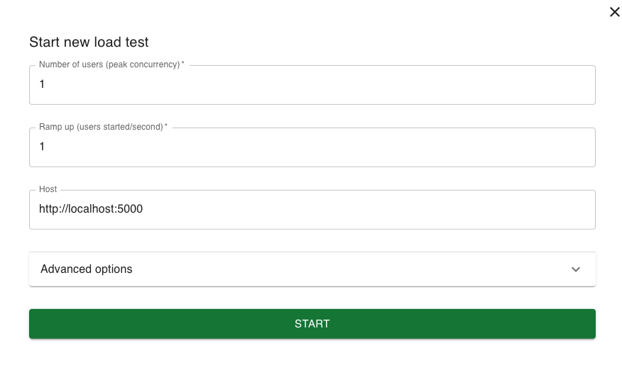

# Rambo


mysql

## 테이블생성
```angular2html
mix ecto.gen.migration #{테이블명}
ex) mix ecto.gen.migration create_chat_rooms
 -> 생성위치 rambo/priv/repo/migrations
```

## 마이그레이션 실행 명령어
```angular2html
mix ecto.migrate
```

## mix.exs 의존성추가 

## 의존성 다운받기
```
mix deps.get
```

## local ddb 설정
```angular2html
aws dynamodb create-table \
--endpoint-url http://localhost:8000 \
--table-name messages \
--attribute-definitions \
AttributeName=id,AttributeType=S \
AttributeName=message_id,AttributeType=S \
--key-schema \
AttributeName=id,KeyType=HASH \
AttributeName=message_id,KeyType=RANGE \
--billing-mode PAY_PER_REQUEST \
--region ap-northeast-2
```

```angular2html
aws dynamodb create-table \
--table-name talk_messages \
--attribute-definitions \
AttributeName=id,AttributeType=S \
AttributeName=message_id,AttributeType=S \
--key-schema \
AttributeName=id,KeyType=HASH \
AttributeName=message_id,KeyType=RANGE \
--billing-mode PAY_PER_REQUEST \
--endpoint-url http://localhost:8000 \
--region ap-northeast-2
```

## 부하 테스트
### 1. locust 설치
```
# 프로젝트 디렉토리로 이동
cd ~/Documents/GitHub/rambo  # 프로젝트 디렉토리로 이동
# 가상환경 생성
python3 -m venv venv
# 가상환경 활성화
source venv/bin/activate
# pip 업그레이드
pip3 install --upgrade pip
# locust 설치
pip3 install locust
# locust가 설치된 경로 확인
which locust
# 버전 확인
locust -V
# locust
locust 실행
```
### 2. 테스트하기
1. locust 실행 시 웹 브라우저로 이동 후 접속됩니다.
- http://localhost:8089 접속하여 [NEW] 버튼 클릭

- 각 필드 설명
    - Number of users: 시뮬레이션할 사용자 수
    - Ramp up: 초당 생성할 사용자 수
    - Host: 테스트할 서버 주소
2. 이제 웹 인터페이스에서 [START] 버튼을 클릭하면 부하 테스트가 시작됩니다.
- host 값은 실제 테스트하려는 서버의 URL로 변경해야 합니다.
- Flask 애플리케이션이 실행 중이어야 합니다.
- 테스트하려는 엔드포인트에 맞게 task들을 수정하면 됩니다.