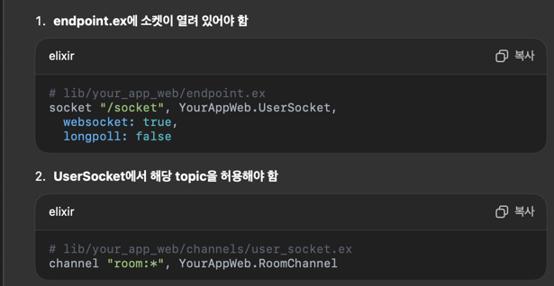

# Rambo



mysql

## 테이블생성
```angular2html
mix ecto.gen.migration #{테이블명}
ex) mix ecto.gen.migration create_chat_rooms
 -> 생성위치 rambo/priv/repo/migrations
```

## 마이그레이션 실행 명령어
```angular2html
mix ecto.migrate
```

## mix.exs 의존성추가 

## 의존성 다운받기
```
mix deps.get
```

## local ddb 설정
```angular2html
aws dynamodb create-table \
  --endpoint-url http://localhost:8000 \
  --table-name messages \
  --attribute-definitions \
    AttributeName=chat_room_id,AttributeType=S \
    AttributeName=created_at,AttributeType=S \
  --key-schema \
    AttributeName=chat_room_id,KeyType=HASH \
    AttributeName=created_at,KeyType=RANGE \
  --billing-mode PAY_PER_REQUEST \
  --region ap-northeast-2
```

```angular2html
aws dynamodb create-table \
--table-name talk_messages \
--attribute-definitions \
AttributeName=id,AttributeType=S \
AttributeName=message_id,AttributeType=S \
--key-schema \
AttributeName=id,KeyType=HASH \
AttributeName=message_id,KeyType=RANGE \
--billing-mode PAY_PER_REQUEST \
--endpoint-url http://localhost:8000 \
--region ap-northeast-2
```

